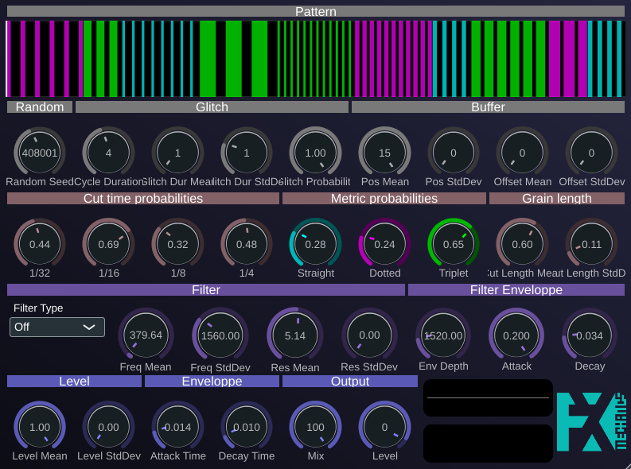

# Gloubiboulga




Gloubiboulga is a real-time audio glitch, stutter, and filtering effect plugin. It's designed to create complex rhythmic patterns by slicing, dicing, and rearranging incoming audio in sync with your DAW's tempo.

## How it works

The plugin continuously records the last musical measure into a circular buffer. When activated, it generates a "glitch cycle" based on a wide array of user-defined parameters. This cycle is a sequence of instructions that dictates how the plugin will process the audio for a set number of measures.

A cycle is composed of several "steps". For each step, the plugin decides whether to let the audio pass through untouched or to apply a "glitch".

When a glitch is triggered, the plugin:
1.  Picks a start position within the recorded audio buffer.
2.  Determines a repeat rate (e.g., 16th notes, 8th note triplets).
3.  Repeatedly plays a small grain of audio from that start position at the chosen rate.
4.  Applies envelopes for volume and filtering to each grain.
5.  This process continues for the duration of the "glitch step".

Once a cycle is generated, it will loop until a parameter is changed, at which point a new, unique cycle is created. The `Random Seed` parameter allows for reproducible patterns.

## Parameters

The user interface is organized into logical sections, each controlling a different aspect of the glitch generation.

Many of the parameters in Gloubiboulga come in pairs: a **Mean** value and a **Standard Deviation** (StdDev). These are used to control a normal (or Gaussian) random number generator. The `Mean` parameter sets the central, most likely value for a given attribute (like the length of a glitch or the filter frequency). The `StdDev` parameter determines how much the actual generated values can vary from this mean. A low standard deviation will result in more consistent and predictable behavior, while a high standard deviation will introduce more randomness and unpredictability into the effect.

#### Pattern
*   **Visualizer**: Shows the generated glitch cycle. Green blocks are pass-through, while colored blocks are glitches. The color of the glitch block indicates the grain's rhythmic subdivision (Cyan for straight, Magenta for dotted, Lime for triplet).
*   **Random Seed**: An integer used to seed the random number generator. The same seed with the same parameters will always produce the same glitch cycle.
*   **Cycle Duration**: The length of one full glitch cycle, in measures.

#### Glitch
*   **Glitch Dur Mean / StdDev**: Controls the average length and variation of each step (glitch or non-glitch) within the cycle.
*   **Glitch Probability**: The chance that any given step in the cycle will be a glitch.

#### Buffer
*   **Pos Mean / StdDev**: Controls the average start position and variation for reading audio from the internal buffer. The position is relative to the start of the measure.
*   **Offset Mean / StdDev**: Adds a finer, randomized offset to the start position.

#### Cut Time Probabilities
*   These knobs control the probability of choosing a specific rhythmic subdivision for the glitch grains.
    *   **1/32, 1/16, 1/8, 1/4**: Sets the chance for 32nd, 16th, 8th, or quarter note repeats.

#### Metric Probabilities
*   These knobs modify the chosen rhythmic subdivision.
    *   **Straight**: Normal timing.
    *   **Dotted**: Dotted note timing (1.5x duration).
    *   **Triplet**: Triplet timing (2/3x duration).

#### Grain Length
*   **Cut Length Mean / StdDev**: Controls the audible portion of each grain. A value of 1.0 means the grain plays for its full rhythmic duration, while a value of 0.5 means it plays for half the duration followed by silence.

#### Level & Enveloppe
*   **Level Mean / StdDev**: The average volume and variation for each grain.
*   **Attack Time / Decay Time**: Applies a very short attack/decay envelope to each grain to prevent clicks and shape its transient.

#### Filter & Filter Enveloppe
*   **Filter Type**: Selects the filter applied to the glitched signal. It can be bypassed ("Off"), a standard Lowpass filter, or one of several formant filters that simulate vowel sounds.
*   **Freq Mean / StdDev**: Controls the filter's cutoff or center frequency.
*   **Res Mean / StdDev**: Controls the filter's resonance or Q-factor.
*   **Env Depth**: The amount of modulation applied to the filter frequency by a dedicated envelope.
*   **Attack / Decay**: The attack and decay time of the filter's envelope.

#### Output
*   **Mix**: Controls the balance between the original (dry) signal and the effected (wet) signal. 0% is fully dry, 100% is fully wet.
*   **Level**: The final output volume of the plugin.
*   **Scopes**: The dual scrolling scopes at the bottom right visualize the final stereo output signal.

## Installation

Pre-built binaries are available on the [Releases](../../releases) page. Download the zip for your platform and follow the instructions below.

---

### macOS — AU in Logic Pro

1. Unzip the downloaded archive and locate `Gloubiboulga.component`.
2. Copy it to your user plug-in folder:
   ```sh
   cp -r Gloubiboulga.component ~/Library/Audio/Plug-Ins/Components/
   ```
3. **Gatekeeper quarantine:** macOS will block any plugin that is not signed with an Apple Developer certificate. Remove the quarantine flag before opening Logic:
   ```sh
   xattr -dr com.apple.quarantine ~/Library/Audio/Plug-Ins/Components/Gloubiboulga.component
   ```
4. Open (or restart) Logic Pro. It scans the Components folder on startup.
5. If Logic marks it as *Failed* in the Plug-in Manager, open **Logic Pro > Settings > Plug-in Manager**, find Gloubiboulga, and click **Reset & Rescan**.

> **System-wide install** (all users): copy to `/Library/Audio/Plug-Ins/Components/` instead (requires `sudo`).

---

### macOS — VST3 in Reaper

1. Copy `Gloubiboulga.vst3` to `~/Library/Audio/Plug-Ins/VST3/`.
2. Remove the quarantine flag:
   ```sh
   xattr -dr com.apple.quarantine ~/Library/Audio/Plug-Ins/VST3/Gloubiboulga.vst3
   ```
3. In Reaper: **Options › Preferences › Plug-ins › VST** → click **Re-scan**.

---

### Windows — VST3 in Reaper

1. Unzip and copy the `Gloubiboulga.vst3` folder to:
   ```
   C:\Program Files\Common Files\VST3\
   ```
2. In Reaper: **Options › Preferences › Plug-ins › VST** → click **Re-scan**.

> If Reaper does not pick it up after a rescan, verify that the VST3 path above is listed under **VST plug-in paths** in the same preferences panel. Add it manually if needed.

---

### Linux — VST3 in Reaper

1. Copy the `Gloubiboulga.vst3` directory to `~/.vst3/`:
   ```sh
   cp -r Gloubiboulga.vst3 ~/.vst3/
   ```
2. In Reaper: **Options › Preferences › Plug-ins › VST** → click **Re-scan**.

---

## Contact

olivier.doare@ensta.fr
